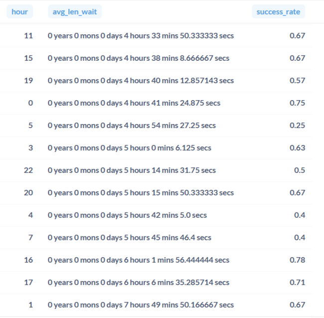
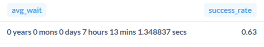
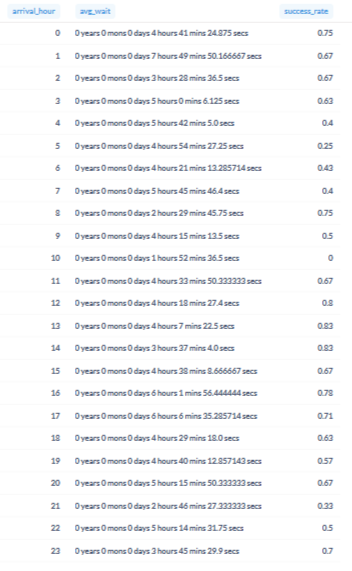

# Airport Queue Analysis

## Project Overview

This SQL project analyzes airport queue performance for a ride-hailing service.

The objective is to evaluate airport queue efficiency, identify experienced airport drivers, and determine the optimal arrival time at Domodedovo Airport to maximize the probability of receiving an order while minimizing waiting time.

The analysis is based on airport visit data using SQL joins, subqueries, Common Table Expressions (CTEs), aggregation, and date/time calculations.

---

## Business Tasks

The project focuses on three analytical tasks:

1. Identify experienced airport drivers and compare successful and unsuccessful departures.
2. Evaluate airport queue efficiency using average waiting time and departure success rate.
3. Determine the optimal arrival time at Domodedovo Airport based on waiting time and the probability of receiving an order.

---

## Dataset

Table used:

- `airport_visit` — airport queue visit history

---

## SQL Techniques

- Common Table Expressions (CTEs)
- Subqueries
- JOIN
- Aggregate Functions
- CASE WHEN
- Date & Time Arithmetic
- EXTRACT()
- GROUP BY
- ORDER BY

---

## Project Workflow

### Driver Performance Analysis

Selected drivers who visited airports more than once and identified the top 10 drivers with the longest average waiting time.

Compared the number of successful and unsuccessful departures for this driver segment.

**Result**



---

### Airport Queue Efficiency

Calculated:

- average airport waiting time;
- departure success rate.

The analysis included only:

- airports with more than 100 airport visits;
- drivers who spent more than 12 hours waiting in airport queues.

**Result**



---

### Optimal Arrival Time Analysis

Compared average waiting time and departure success rate by arrival hour at Domodedovo Airport.

The resulting analysis helps identify the hours that provide the best balance between queue duration and the likelihood of receiving an order.

**Result**



The highest probability of receiving an order is observed during the morning hours, while average waiting time remains relatively low, making these periods the most efficient for airport arrivals.
---

## Skills Demonstrated

- SQL
- PostgreSQL
- Common Table Expressions (CTEs)
- Subqueries
- JOIN
- Aggregate Functions
- Date & Time Functions
- Business Analysis
- Operational Analytics

---

## Repository Structure

```text
airport_queue_analysis/
│
├── images/
│   ├── task1_result.png
│   ├── task2_result.png
│   └── task3_result.png
│
├── README.md
└── airport_queue_analysis.sql
```

---

## Key Takeaways

This project demonstrates how SQL can be used to analyze operational processes in a ride-hailing service.

The resulting analyses help identify experienced airport drivers, evaluate airport queue efficiency, and determine the optimal arrival time based on waiting time and the probability of receiving an order.

---

## Author

**Daria Sinitsyna**  
Junior Data Analyst
