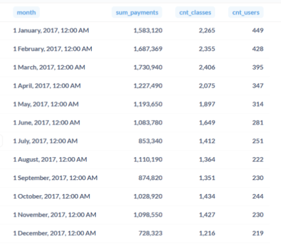

# Monthly Business Metrics Analysis

## Project Overview

This SQL project analyzes monthly business performance for an online education platform.

The objective is to validate the hypothesis that the decline in revenue during 2017 was associated with a decrease in both lesson activity and the number of active students.

The analysis combines payment and lesson data into a single monthly analytical dataset.

---

## Business Task

Validate the following business hypothesis:

> During 2017, the decline in revenue was caused by a reduction in:
>
> - the total number of successful lessons;
> - the total number of active students.

The project compares monthly revenue, lesson activity, and student activity throughout 2017.

---

## Dataset

Tables used:

- `payments` — payment transactions
- `classes` — lesson history

---

## SQL Techniques

- Nested Subqueries
- Aggregate Functions
- FULL JOIN
- COUNT(DISTINCT)
- DATE_TRUNC()
- GROUP BY
- ORDER BY

---

## Project Workflow

### Monthly Revenue Aggregation

Calculated total monthly revenue using successful payment transactions.

- Filtered successful payments.
- Aggregated revenue by month.

### Monthly Lesson Activity

Calculated operational metrics for each month.

- Filtered successful lessons.
- Counted completed lessons.
- Counted active students.

### Business Metrics Integration

Combined both aggregated datasets into a unified monthly analytical table.

- Joined payment and lesson statistics.
- Prepared the dataset for business hypothesis validation.

---

## Results

The query produced the following monthly business metrics for 2017.



---

## Business Conclusion

The analysis shows that revenue generally declined during 2017.

The decrease in revenue was accompanied by a reduction in both the number of successful lessons and the number of active students.

Although several months showed temporary increases, the overall downward trend supports the business hypothesis that lower operational activity contributed to the decline in revenue.

---

## Skills Demonstrated

- SQL
- PostgreSQL
- Nested Subqueries
- Aggregate Functions
- Business Metrics Analysis
- Time Series Aggregation
- Data Aggregation
- Business Analysis

---

## Repository Structure

```
monthly_business_metrics_analysis/
│
├── README.md
├── monthly_business_metrics_analysis.sql
└── results.png
```

---

## Author

**Daria Sinitsyna**

Junior Data Analyst

## Author

**Daria Sinitsyna**

Junior Data Analyst
